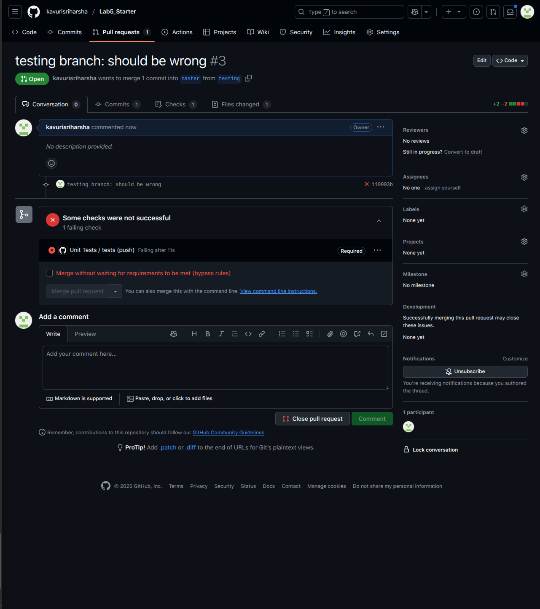
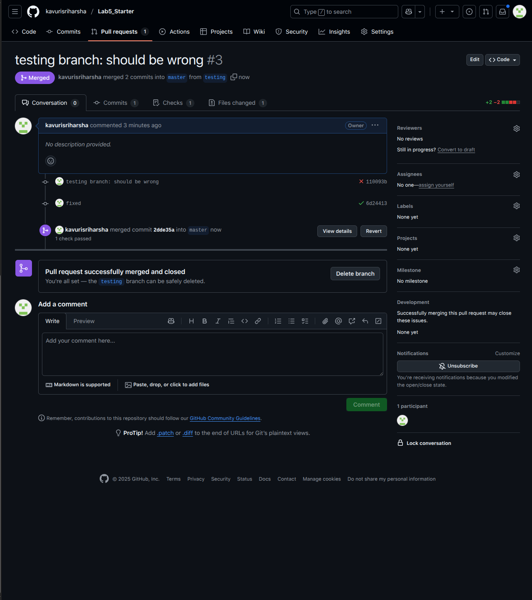

# Lab 5 - Starter

Team Members:
- Sriharsha Kavuri
- Fabio Ruhland

1. One wouldn't write a unit test for this because its too broad and unit tests should test an individual component.

2. This would be a good candidate for a unit test because it tests a specific function and its output.

